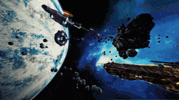

# @dot-event/controller

dot-event dom controllers



## Install

```bash
npm install dot-event @dot-event/controller
```

## Setup

```js
const dot = require("dot-event")()
require("@dot-event/controller")(dot)
```

## Usage

First create your controller composer:

```js
export default function(dot) {
  if (dot.myController) {
    return
  }
  dot.controller("myController", { render, update })
}

function myController() {
  // control stuff
}
```

Then use it:

```js
require("./myController").default(dot)

dot.myController()
```

## Props

Commonly we append the controller name to [the `prop` array](https://github.com/dot-event/dot-event2#props) and pass the concatenated props to sub-events.

Passing those props down produces descriptive element ids and [logs](https://github.com/dot-event/log2) that describe the call stack.

Luckily, the `controller` composer injects the controller name into [the `prop` array](https://github.com/dot-event/dot-event2#props) automatically, eliminating the controller name append step.

## Related composers

| Library | Description        | URL                                        |
| ------- | ------------------ | ------------------------------------------ |
| el      | DOM elements       | https://github.com/dot-event/el#readme     |
| render  | Server side render | https://github.com/dot-event/render#readme |
| view    | DOM views          | https://github.com/dot-event/view#readme   |
